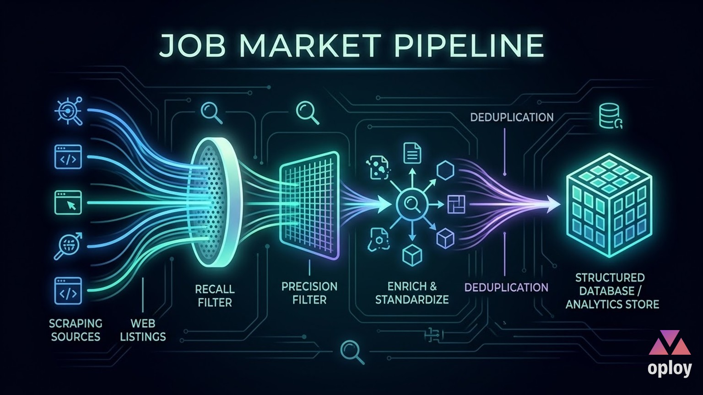
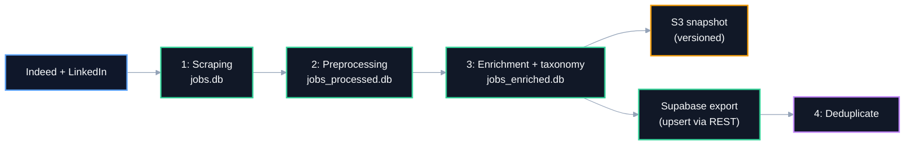
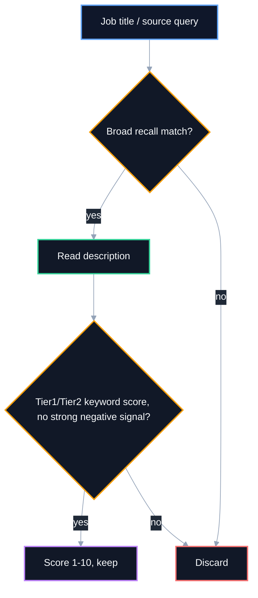
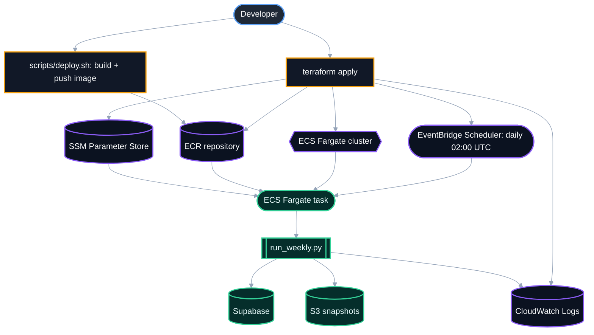

# Job Market Pipeline [job.oploy.eu](https://job.oploy.eu)

<p align="center">
  <a href="https://job.oploy.eu">
    
  </a>
</p>

Python **data pipeline** for scraping, filtering, normalizing, deduplicating, and exporting job-market data, deployed as a **daily scheduled AWS Fargate task** provisioned with **Terraform**.


> ⭐ If this project is useful for your work or research, consider starring it.

## Overview

This is the ingestion layer for the **JobLab** product family: a general-purpose job-scraping **data pipeline**, currently tuned to Optimization / Operations Research / Data Science roles as a concrete example domain. It runs unattended, once a day, on **AWS ECS Fargate**, and feeds a Supabase Postgres database consumed by [joblab-analytics-frontend](https://github.com/Mbehbahani/joblab-analytics-frontend) and [joblab-agent-api](https://github.com/Mbehbahani/joblab-agent-api).

The pipeline is built around a practical retrieval principle:

- **Recall** — cast a wide net with broad title/query keywords so relevant postings aren't missed.
- **Precision** — validate with description-level technical keywords and negative-keyword exclusions so the final dataset stays clean.

This matters because job titles are noisy: a role requiring mathematical optimization skill might be titled `Decision Scientist`, `Supply Chain Analyst`, or `Applied Scientist` as often as `Operations Research Scientist`.

**This repository is best described as:**

- A **6-stage** pipeline: scrape → preprocess → enrich/standardize → S3 snapshot → Supabase export → dedupe
- A **daily-scheduled, containerized AWS workload** — Fargate task, EventBridge Scheduler, Terraform-provisioned infrastructure
- A pipeline with real **NLP/skill-extraction** logic, not just scraping — job-relevance scoring, taxonomy standardization, and structured skill/tool extraction

## Tech stack

| Component | Responsibility | Tech |
|---|---|---|
| Scraping | Multi-source collection | `python-jobspy`, `requests`, `aiohttp` |
| Stage storage | Intermediate datasets between steps | SQLite |
| NLP | Language detection, skill/tool extraction | `langdetect`, custom extractors |
| Export | Final job-market dataset | Supabase (Postgres, REST API) |
| Orchestration | Single-entrypoint daily run | `src/orchestrate/run_weekly.py` |
| Containerization | Reproducible runtime | Docker |
| Compute | Scheduled unattended execution | **AWS ECS Fargate** |
| Scheduling | Daily trigger | **AWS EventBridge Scheduler** — `cron(0 2 * * ? *)` |
| Secrets | Deploy-time configuration | AWS SSM Parameter Store |
| IaC | Infrastructure provisioning | **Terraform** (primary) + CloudFormation (`cfn/`) |

## Architecture



### Filtering logic (recall then precision)



Relevance scoring (1–10) is documented in [`3- Enrichment + Standardization/JOB_RELEVANCE_SCORE.md`](3-%20Enrichment%20%2B%20Standardization/JOB_RELEVANCE_SCORE.md): a base score from tier1/tier2 keyword presence, adjusted by keyword frequency in title and description.

## NLP: skill and tool extraction

[`src/analysis/skill_extraction/`](src/analysis/skill_extraction/) pulls structured skill and tool mentions out of free-text job descriptions (`skill_extractor.py`, `tool_extractor.py`), matched against a controlled vocabulary in [`src/config/skills_reference.json`](src/config/skills_reference.json) and [`src/config/tools_reference.json`](src/config/tools_reference.json) — the same taxonomy that powers the skills/tools charts in [joblab-analytics-frontend](https://github.com/Mbehbahani/joblab-analytics-frontend).

## Quickstart

```bash
git clone https://github.com/Mbehbahani/joblab-data-pipeline.git
cd joblab-data-pipeline
python -m venv .venv && .venv\Scripts\Activate.ps1
pip install -r requirements.txt
cp .env.example .env   # fill in Supabase + AWS values
```

### Run the full local pipeline

```bash
python src/orchestrate/run_weekly.py --local           # full run, no S3 upload
python src/orchestrate/run_weekly.py --local --dry-run # skip Supabase push
python src/orchestrate/run_weekly.py --local --skip-scrape
```

### Run a single stage

```bash
python "1- Scrapped Data/job_scraper.py" --jobs 50 --countries "Germany,Netherlands"
python "2- Preprocessed/preprocess.py"
python "3- Enrichment + Standardization/taxonomy_standardization.py"
python "4- Deduplicate/deduplicate_supabase.py"
```

### Docker

```bash
docker build -t joblab-pipeline .
docker run --rm --env-file .env joblab-pipeline python src/orchestrate/run_weekly.py --local
```

## Configuration

All variables are documented in [`.env.example`](.env.example).

| Variable | Required | Default | Description |
|---|---|---|---|
| `SUPABASE_URL` | export only | — | Target Supabase project URL |
| `SUPABASE_SERVICE_ROLE_KEY` | export only | — | Server-side key for upserts |
| `S3_BUCKET` | AWS only | — | Bucket for snapshots and dedup tracking |
| `S3_PREFIX` | no | `joblab-supabase` | S3 key prefix |
| `AWS_REGION` | no | `us-east-1` | AWS region |
| `SCRAPE_COUNTRIES` | no | all | Comma-separated country list |
| `SCRAPE_MAX_JOBS` | no | `50` | Max jobs per country per run |
| `DAYS_BACK` | no | `7` | Lookback window for recency filtering |
| `DRY_RUN` | no | `false` | Skip Supabase push |
| `CLEAR_SUPABASE` | no | `false` | Clear tables before a full refresh |

## Project structure

```text
.
├── 1- Scrapped Data/
│   └── job_scraper.py
├── 2- Preprocessed/
│   └── preprocess.py
├── 3- Enrichment + Standardization/
│   ├── JOB_RELEVANCE_SCORE.md
│   └── taxonomy_standardization.py
├── 4- Deduplicate/
│   └── deduplicate_supabase.py
├── src/
│   ├── analysis/skill_extraction/   # NLP skill + tool extraction
│   ├── config/                       # skills/tools controlled vocabulary
│   ├── db/
│   ├── export/to_supabase.py         # Supabase REST client, dedup strategy
│   ├── models/
│   └── orchestrate/run_weekly.py     # daily pipeline entrypoint
├── scripts/                            # AWS setup, deploy, manual-run scripts
├── terraform/                           # ECS Fargate + EventBridge + IAM IaC
├── cfn/                                  # CloudFormation alternative
├── Dockerfile
├── task-definition.json
├── .env.example
├── LICENSE
└── requirements.txt
```

## Deployment

Deployed as a **daily containerized pipeline on AWS**: Terraform provisions an ECR repository, an ECS Fargate cluster/task, IAM roles, CloudWatch logging, an SSM parameter for secrets, and an EventBridge schedule (`cron(0 2 * * ? *)`, daily at 02:00 UTC).



```bash
cd terraform
terraform init
terraform apply

./scripts/deploy.sh          # build + push image to ECR
./scripts/run-manual.sh      # trigger a one-off task run
aws logs tail /ecs/joblab-pipeline --follow
```

## Roadmap / TO-DO

- [ ] Add automated tests for the enrichment/scoring stage
- [ ] Publish relevance-scoring precision/recall metrics
- [ ] Add CI (lint) via `.github/workflows/`

## Related links

- [joblab-agent-api](https://github.com/Mbehbahani/joblab-agent-api) — AI agent backend consuming this pipeline's Supabase output
- [joblab-analytics-frontend](https://github.com/Mbehbahani/joblab-analytics-frontend) — dashboard visualizing this data

## Security note

This repository's git history was scrubbed of a plaintext database password with `git-filter-repo` prior to publication.

## License

[MIT](LICENSE) © 2026 M.Behbahani
